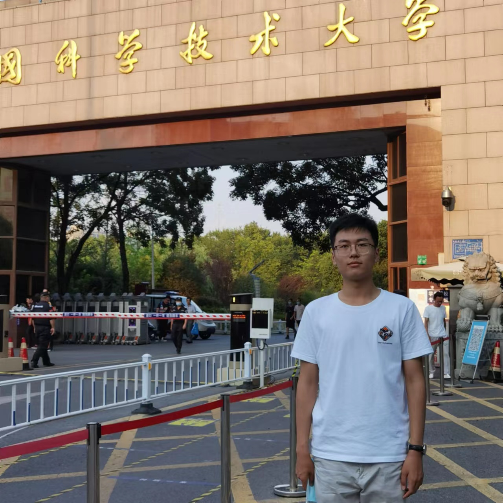

Searching for a Ph.D. position for the Fall 2024 intake

    

        
Your text goes here.

    

    

* I'm a third-year undergraduate student from [School of Information Science and Technology](https://sist.ustc.edu.cn/), University of Science and Technology of China[(USTC)](https://www.ustc.edu.cn/). I am very fortunate to be advised by [Prof. Dong Liu](https://faculty.ustc.edu.cn/dongeliu/en/index.htm) of [Intelligent Visual Data Coding Lab](https://ustc-ivclab.github.io/) from School of Information Science and Technology, USTC.
* My research interests lie in deep learning, machine learning, and their intersection.
* Click [Here](../assets/CV.pdf) to view my up-to-date CV. If you are interested in knowing more about me, please feel free to [contact me](https://xinhengding.github.io/mail/).

<!--[Email](mailto:dxh3382@mail.ustc.edu.cn) / [Github](https://github.com/XinhengDing) / [Wechat](../images/wechat.jpg) -->
