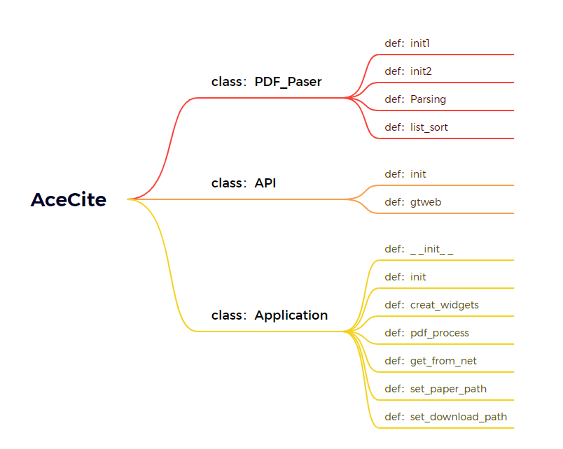

# Motivation

* In scientific research, the process of finding the bibliography (BIB) of a paper to cite it in one's own research or locating the PDF files of references for in-depth reading is a very common scenario. However, this is a repetitive task that requires researchers to perform manually, lacking automation.
* This is a programming assignment for the Deep Learning Practicum course, aimed at practicing Python programming skills by implementing a network-related, functionally practical software.

# Features

* Through the GUI interface, you can select the PDF file you want to parse using a file dialog. The selected file should be an article related to a specific field, taking CVPR (Computer Vision and Pattern Recognition) as an example. Additionally, you can specify the download path for the selected file.
* All the references will be displayed in the graphical user interface. At the same time, the corresponding BIB files/PDF files will be automatically downloaded to the selected download path.

# Tech Stack

* Developed in Python programming language.
* Parse PDF files using `PDFminer.six`&`re`
* Utilizes `tkinter` for GUI

# Architecture Design

The project is divided into three parts: PDF_Parser, API, and Application.

* PDF_Parser is responsible for parsing the content of PDF files.

* API handles the process of making calls to URLs and crawling the target resources.

* Application is responsible for managing the overall control logic of the project.

You can find the source code on [GitHub](https://github.com/XinhengDing/DLP_HW1)
