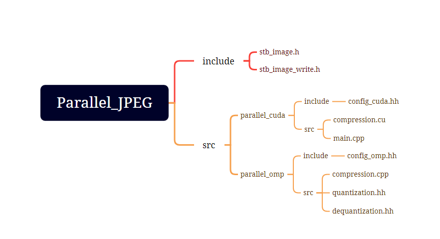

# Motivation

* This is the course project for Parallel Computing, designed to enhance fundamental skills in OpenMP and CUDA parallel programming.

* JPEG compression process is suitable for CUDA/OpenMP parallel acceleration for the following reasons:
  * Data Independence: In the JPEG compression process, different blocks of an image are often subjected to the same calculations. This means that the processing of each block is independent of others. Such data independence makes parallel processing feasible, enabling CUDA/OpenMP to simultaneously process multiple blocks on different processing units, thus improving overall processing efficiency.
  * Compute-Intensive Nature: JPEG compression involves a substantial number of mathematical operations, particularly the Discrete Cosine Transform (DCT) and quantization steps. These computations can be parallelized effectively using CUDA/OpenMP, harnessing the computational power of modern multi-core processors and GPUs, leading to faster processing.
  * Large-Scale Data: JPEG compression is frequently applied to high-resolution images and large-scale image datasets. CUDA/OpenMP parallel acceleration can fully exploit the parallel processing capabilities of hardware, significantly reducing processing time when dealing with substantial amounts of data.
  * Spatial Locality: During JPEG compression, operations such as DCT and quantization are typically performed on local windows of pixel data. This spatial locality makes parallel processing more efficient since different processing units' data accesses do not frequently compete for memory bandwidth.

# Features

* A simplified version of JPEG compression and decompression processes has been implemented in C++. 

* The serial program was further accelerated using OpenMP and CUDA. Experiments were conducted to explore and validate the impact of different task scheduling methods and varying thread settings on the acceleration performance. The maximum average speedup achieved using OpenMP and CUDA was 3.74 and 168.9, respectively.

  *Note: In this project, the JPEG compression and decompression processes are simplified by converting RGB images to grayscale images, thereby avoiding repetitive operations like Discrete Cosine Transform, quantization, inverse quantization, and inverse Discrete Cosine Transform on luminance and chrominance channels separately. While this approach is more practical, it is not the primary focus of this project.*

# Tech Stack

* This project is implemented in C++ in a serial manner, and parallel acceleration is achieved using OpenMP and CUDA, respectively.
* Use the `stb_image` library for image reading and writing.

# Architecture Design

The source code and more details can be found on GitHub.
