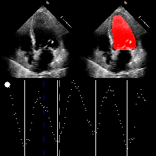

# Method

This project is implemented based on the paper "Video-based AI for beat-to-beat assessment of cardiac function".  EchoNet-Dynamic is a end-to-end beat-to-beat deep learning model for
  1) semantic segmentation of the left ventricle
  2) prediction of ejection fraction by entire video or subsampled clips, and
  3) assessment of cardiomyopathy with reduced ejection fraction.

For more details, see the accompanying paper,

> [**Video-based AI for beat-to-beat assessment of cardiac function**](https://www.nature.com/articles/s41586-020-2145-8) 
> David Ouyang, Bryan He, Amirata Ghorbani, Neal Yuan, Joseph Ebinger, Curt P. Langlotz, Paul A. Heidenreich, Robert A. Harrington, David H. Liang, Euan A. Ashley, and James Y. Zou. <b>Nature</b>, March 25, 2020. https://doi.org/10.1038/s41586-020-2145-8

# Dataset

The dataset includes 10,030 echocardiogram images. Preprocessing of these images, including deidentification and conversion from DICOM format to AVI format videos, were performed with `OpenCV` and `pydicom`. Additional information is at https://echonet.github.io/dynamic/.

# Obstacles & Solutions

* This is my first attempt at implementing weakly supervised learning and semantic segmentation, involving concepts such as Dice coefficient, ROC curve, 3D spatiotemporal convolution, as well as network architectures, along with biological knowledge related to cardiac function and clinical treatments. This has posed certain challenges in terms of comprehending the code and understanding the paper during the replication process.
* I attempted to match the hardware configuration mentioned in the paper, but I encountered difficulties in successfully running the code. When I executed the source code provided by the authors, training processes were often unexpectedly terminated due to memory overflow. Through experimentation, I discovered that adjusting `num_workers` and `pin_memory` could prevent these errors, both of which are related to the CPU settings during data loading.
* Observing the scatter plot obtained from the ejection fraction (EF) prediction task, it can be noted that when the actual EF values are lower, there is a greater deviation between predicted values and ground truth. Conversely, when EF values are larger, the scatter is more concentrated. I attempted to modify various forms of loss functions, but I did not observe significant performance improvements.

# Example

Below is an example that segments the left ventricle and tracks the real-time changes in left ventricular volume.

